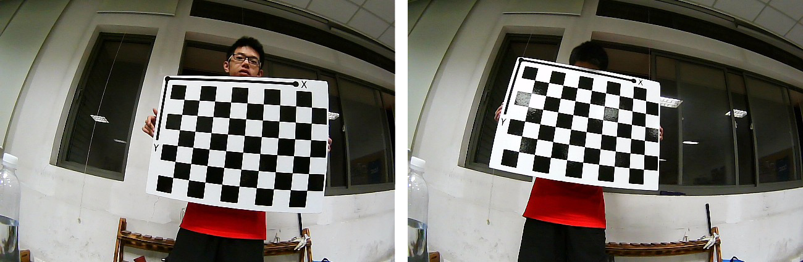
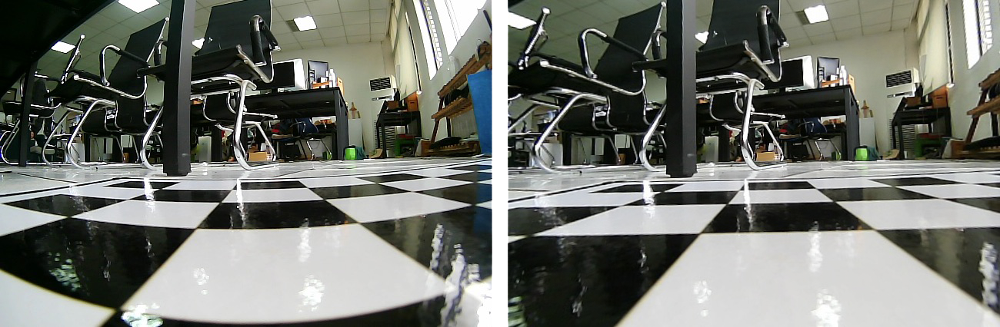
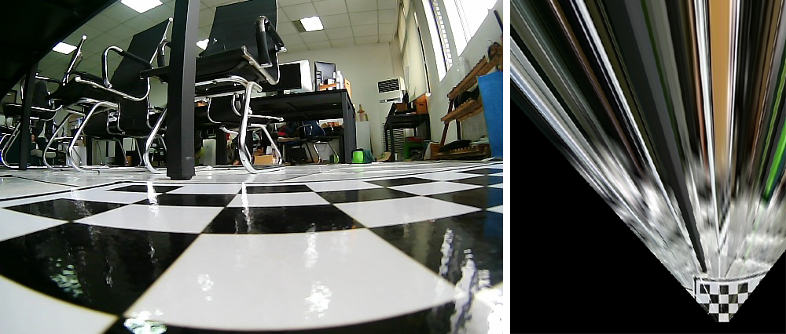

# SpeedBumps-Detection

### 1. 矫正鱼眼畸变

计算 __相机内参(5)__、__畸变参数(3+2 径向、切向)__

Matlab `Camera Calibrator App`

```matlab
% Define images to process
imageFileNames = { '...' };

% Detect checkerboards in images
[imagePoints, boardSize, imagesUsed] = detectCheckerboardPoints(imageFileNames);
imageFileNames = imageFileNames(imagesUsed);

% Generate world coordinates of the corners of the squares
squareSize = 65;  % in units of 'mm'
worldPoints = generateCheckerboardPoints(boardSize, squareSize);

% Calibrate the camera
[cameraParams, imagesUsed, estimationErrors] = estimateCameraParameters(imagePoints, worldPoints, ...
    'EstimateSkew', false, 'EstimateTangentialDistortion', false, ...
    'NumRadialDistortionCoefficients', 3, 'WorldUnits', 'mm', ...
    'InitialIntrinsicMatrix', [], 'InitialRadialDistortion', []);

% View reprojection errors
h1=figure; showReprojectionErrors(cameraParams);

% Visualize pattern locations
h2=figure; showExtrinsics(cameraParams, 'CameraCentric');

% Display parameter estimation errors
displayErrors(estimationErrors, cameraParams);

% For example, you can use the calibration data to remove effects of lens distortion.
originalImage = imread(imageFileNames{1});
undistortedImage = undistortImage(originalImage, cameraParams);

% See additional examples of how to use the calibration data.  At the prompt type:
% showdemo('MeasuringPlanarObjectsExample')
% showdemo('StructureFromMotionExample')
```

#### CheckBoard Images



#### 相机内参

```python
mtx = np.array([[366.8414,        0, 337.4132],
				[       0, 366.1242, 182.8138],
				[       0,        0,   1.0000]])
```

#### 畸变参数

```python
dist = np.array([-0.347049837762688,
				  0.165398310868444,
				                  0,
				                  0,
				-0.0444392622226221])
```



#### 矫正

```python
# -*- coding:utf-8 -*-
# python 2.7
import cv2
import numpy as np

# 畸变参数
dist = np.array([-0.347049837762688,
				  0.165398310868444,
				                  0,
				                  0,
				-0.0444392622226221])

# 内参矩阵
mtx = np.array([[366.8414,        0, 337.4132],
				[       0, 366.1242, 182.8138],
				[       0,        0,   1.0000]])

img = cv2.imread("test.jpg")
dst = cv2.undistort(img,mtx,dist,None,None)
cv2.imwrite("test-output.jpg",dst)
```

### 2. 鸟瞰视图

使用Matlab计算单应矩阵

- 选点：

  ```matlab
  im = imread('im1.jpg');
  imshow(im);
  [xi,yi] = getpts();
  ```

- 计算矩阵

  ```matlab
  K = fitgeotrans([xi yi],[xi2;yi2]','projective');
  B = imwarp(im,K);
  imshow(B);
  ```



### 3. 距离计算

标定：

1. 鸟瞰视图的 像素间距(m/pix)
2. 鸟瞰视图下边界到摄像机的距离

### 4. 目标检测

#### 4.1 数据集

#### 4.2 网络模型

