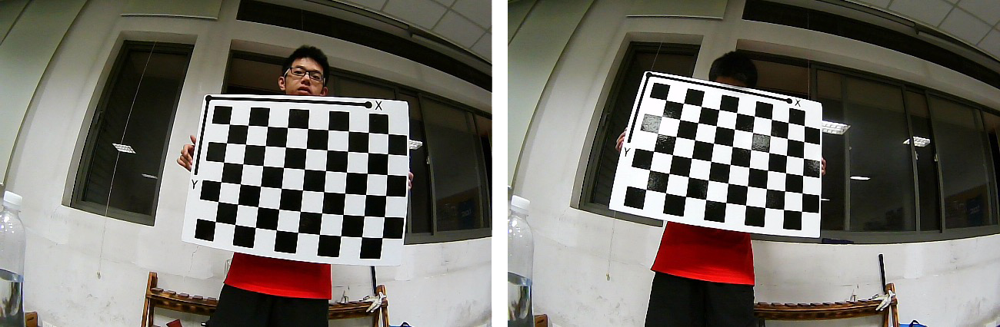
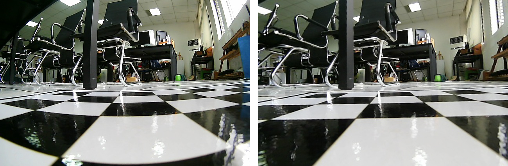
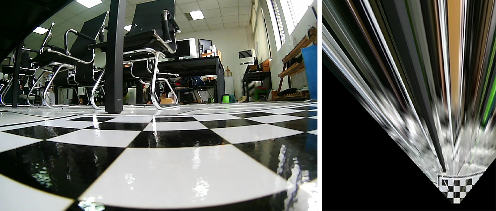
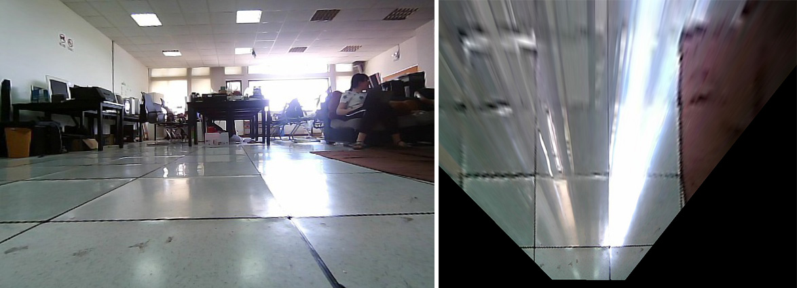
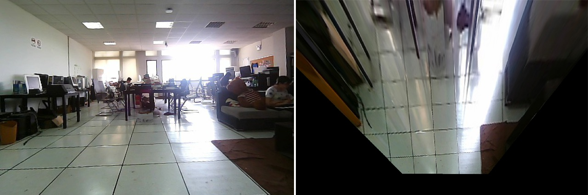
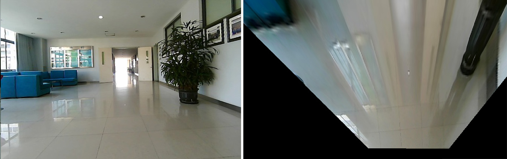
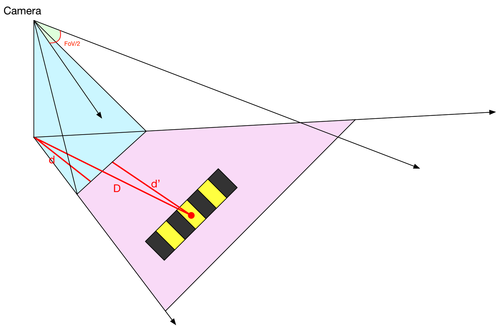
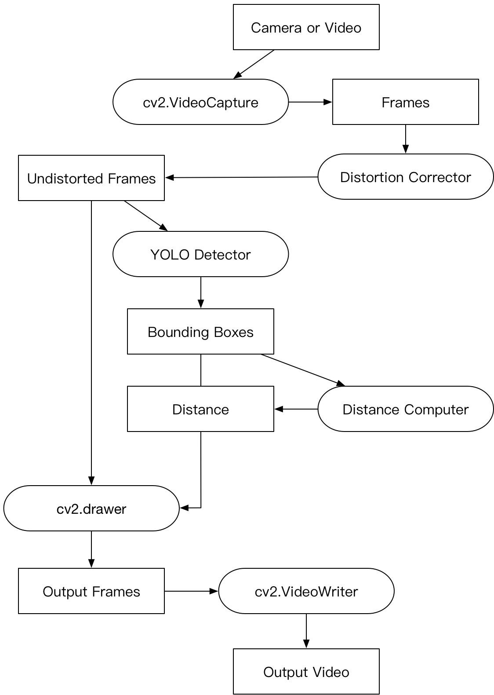
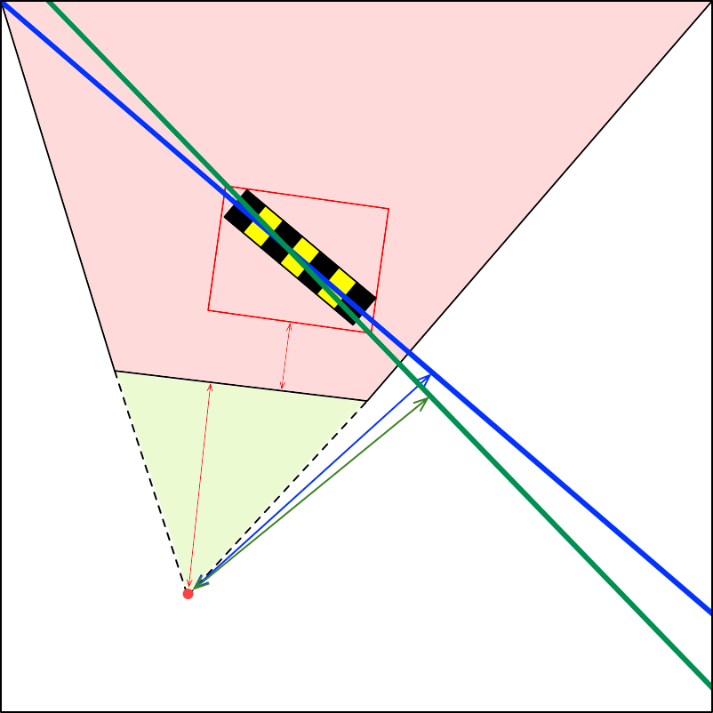

# SpeedBumps-Detection

### 1. 矫正鱼眼畸变

计算 __相机内参(5)__、__畸变参数(3+2 径向、切向)__

Matlab `Camera Calibrator App`

标定的代码见 `./calibration/calibration.m`

#### CheckBoard Images



#### 相机内参

```python
mtx = np.array([[366.8414,        0, 337.4132],
				[       0, 366.1242, 182.8138],
				[       0,        0,   1.0000]])
```

#### 畸变参数

```python
dist = np.array([-0.347049837762688,
				  0.165398310868444,
				                  0,
				                  0,
				-0.0444392622226221])
```



#### 矫正

矫正代码见 `./calibration/test.py`

### 2. 鸟瞰视图

使用Matlab计算单应矩阵

- 选点：

  ```matlab
  im = imread('im1.jpg');
  imshow(im);
  [xi,yi] = getpts();
  ```

- 计算矩阵

  ```matlab
  K = fitgeotrans([xi yi],[xi2;yi2]','projective');
  B = imwarp(im,K);
  imshow(B);
  ```



固定相机角度（螺丝刀，垫纸）

TAC砖代替标定布

困难：标定视野范围有限

解决：鸟瞰视图的转换矩阵跟高度没有关系，所以先把摄像头放在相对比较低的高度，扩大标定范围（标定鸟瞰视图转换矩阵）。然后把摄像头放回小车，标定像素距离单位。

测距最远距离：~6m

__标定图__（原图，实际中先增强对比度，不然找不到点....没有标定布的尴尬）：

假的假的，后来又拿了一张重新拍了，啧啧啧

后来找到了一个好的位置，拍到了范围比较大的图，美滋滋

然后就重新标定了一下，新数据已改，图没换



__标定像素距离单位__：



1. 5*60cm per 298pix
2. 4*60cm per 238pix
3. 3*60cm per 182pix

1 pix =~ 1cm

__测试__：



177(3\*60), 172(3\*60), 236(4\*60)

精度：97.5%

__标定鸟瞰视图底部到摄像机的距离__：

p -> 底部：114像素

p -> 摄像机：4*60 = 240cm

底部 -> 摄像机：126cm

```python
mat = np.array([[-0.5115,   -1.4774,  428.8531],
                [-0.0880,   -3.6296,  847.1490],
                [-0.0001,   -0.0054,    1.0000]
               ])
```
测距代码见 `./toEyesView/birdsView/distance.ipynb`

### 3. 距离计算

标定：

1. 鸟瞰视图的 像素间距(m/pix)
2. 鸟瞰视图下边界到摄像机的距离

图片 => 鸟瞰视图 => 点到图片底部距离d

点到相机距离 pd =? d + d' =? D

d'为底部到相机的距离(待标定)



### 4. 目标检测

#### 4.1 数据集

#### 减速带 bump

1. 手机拍摄 => resize
2. 小摄像头拍摄 => calibration
3. 百度、谷歌图片 => filter => resize

数据标注：labelImg

数据扩充：数据集 => 水平翻转 => 279张

#### 人 person

VOC数据集 => filter => person

#### 4.2 网络模型

Yolo v3

训练集(~2k)：bump * 3 + VOC2007-test * 0.5

验证集(~4k)：bump * 7 + VOC2012-train+val * 0.5

训练步数：30k

### 5. 检测+测距



### 6. 模型评估

计算的距离是框底部到相机的距离，但是当减速带是倾斜的时候，计算的距离就是减速带近点到相机的距离，而不是减速带中心。

当然了，也可以改进测距，计算框的中心到相机的距离再减去减速带的宽，就是减速带到相机的距离。

评估用到的距离数据，测距的时候也不是很准确。

有个问题：对距离的定义略有模糊。这里输出的距离到底是什么？

当前算出来的距离是，__减速带近点__到相机的水平距离，但是我们更倾向于算出相机到减速带的垂直距离，也就是相机到__减速带所在直线__的距离。

#### 优化



蓝：减速带所在直线

绿：对角线所在直线

红：检测框

检测框图像 => resize => CNN => 对角线类型 => 计算相机到对角线的距离

